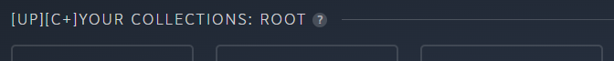

# Collections+

A Millennium plugin that adds extra functionality to collections on Steam.

## Features
- Replace or reset Collection image
- Add/remove applications to/from collections in bulk
- Organize collections into folders

Big thanks to OsuCelsius!

## Prerequisites
- [Millennium](https://steambrew.app/)

## Bulk add/remove filter language
- Multiple predicates can be provided, delimited by `;`
- Each predicate is made up of two or three parts: `<PROPERTY> <OPERATOR> <VALUE>`
- Valid predicates:

|PROPERTY                |VALID OPERATORS    |VALUE TYPE|DESCRIPTION                                                    |
|------------------------|-------------------|----------|---------------------------------------------------------------|
|collection              |= !=               |string    |application is (=) or is not (!=) part of the named collection |
|category                |= !=               |number    |application is (=) or is not (!=) part of the given category   |
|tag                     |= !=               |number    |application has (=) or does not have (!=) the given tag        |
|\<ANY BOOLEAN PROPERTY\>|true false         |          |property is true or false                                      |
|\<ANY STRING PROPERTY\> |= != begins        |string    |property equals, does not equal, or begins with the given value|
|\<ANY NUMBER PROPERTY\> |= != \< \> \<= \>= |number    |yes                                                            |

- Examples:
    - Applications where the name begins with "W": `display_name begins W`
    - Applications that are part of the "UTIL" Collection: `collection = UTIL`
    - Applications where the name begins with "W", that are part of the "UTIL" collection and have been played for more than 10 minutes: `display_name begins W;collection = UTIL;minutes_playtime_forever > 10`

## Collection Folders
- On your Collections page, click `[UP]` to leave a folder,
- Click `[C+]` to open a windows where you can create subfolders and add (or remove) collections to (from) the current folder,
- They look like this, on the Collections page, with the default theme:

- Right click a folder and choose `Delete folder` to delete a folder and ALL of its subfolders
    - All contained collections will be moved out to the Root folder
- On an application page, click the `Co` button to open the new Collections window

## Known issues
- Folder images might not work on some themes, including Simple Dark and Minimal Dark
- Text-based filtering instead of a full-fledged UI
    - Yeah...
- Steam dynamically loads and unloads elements on scroll, which can break Collection Folders and Collection filtering functionality
    - If you know how to force Steam to not do this, please open a PR