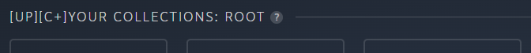

# Collections+

A Millennium plugin that adds extra functionality to collections on Steam.

## Features
- Replace or reset collection image
- Add/remove applications to/from collections in bulk
- Start or show random application from collection
    - Can also choose from the installed ones only
- Organize collections into folders
    - Replace or reset folder image
    - Add/remove collections in bulk
- Collection manager UI for applications

Big thanks to OsuCelsius!

## Prerequisites
- [Millennium](https://steambrew.app/)

## Installation
- Copy the plugin ID from the [Millennium plugins](https://steambrew.app/plugins) page
- Click `Plugins` and `Install a plugin` in the Millennium settings and paste the ID
- Allow 10 seconds for the plugin to load after each startup

## Installation - dev build
- Download a dev build from GitHub Releases
- Overwrite the contents of the plugin under the plugins directory (usually `c:\Program Files (x86)\Steam\plugins`)
- Enable the plugin in the Millennium settings if needed
- Allow 10 seconds for the plugin to load after each startup

## Collection Folders
- On your Collections page, click `[UP]` to leave a folder,
- Click `[C+]` to open a windows where you can create subfolders and add (or remove) collections to (from) the current folder,
- They look like this, on the Collections page, with the default theme:

- Right click a folder and choose `Delete folder` to delete a folder and ALL of its subfolders
    - All contained collections will be moved out to the Root folder
- Right click a folder and choose `Set folder image` or `Reset folder image` to set/unset an image for the folder

## Colletion Management for Applications
- On an application page, click the `C+` button to open the new Collections window

## Known issues
- Collection preview as Collection image does not work if any Folders are used
    - This is a workaround because of the way Steam loads lists
- Folder images might not work on some themes